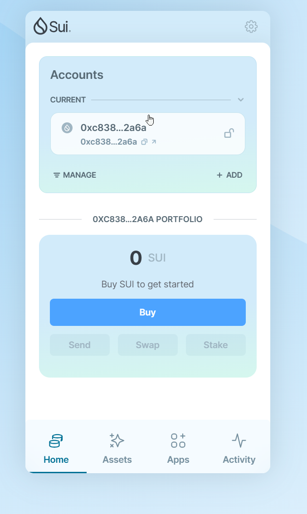
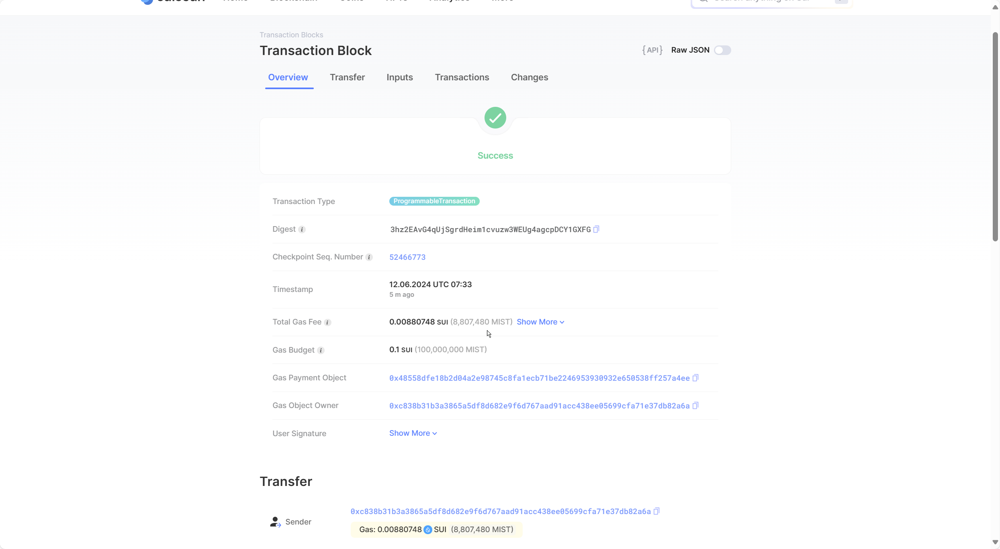
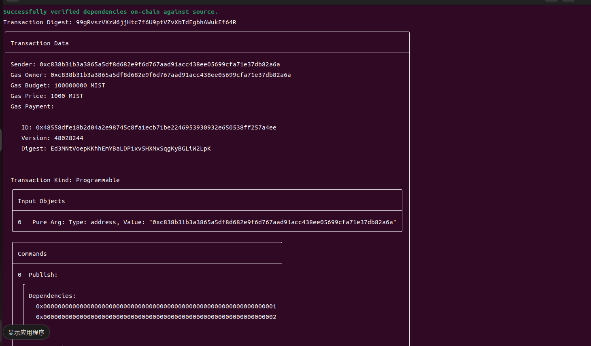
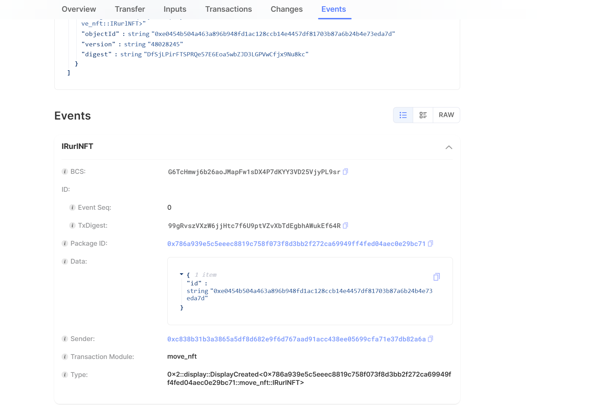
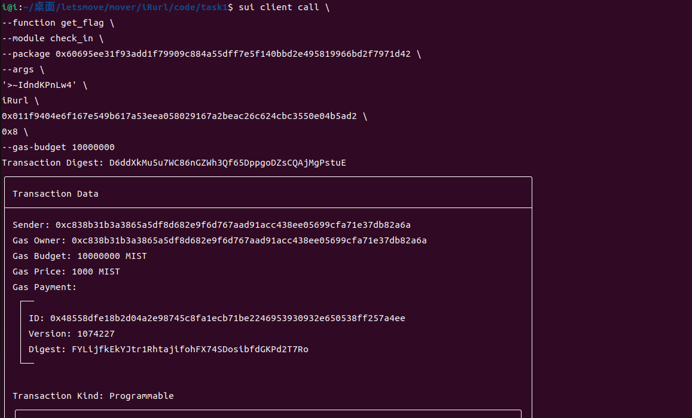
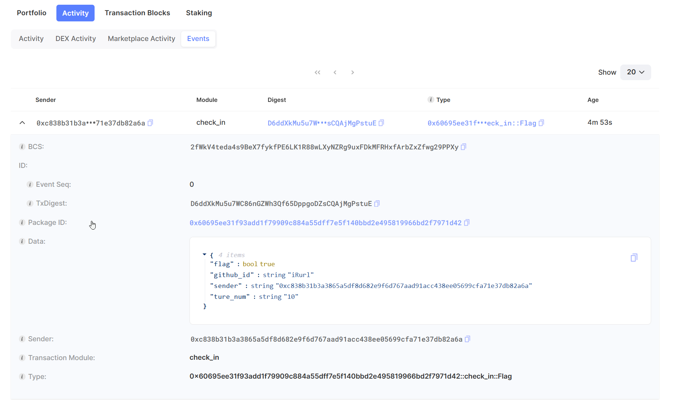
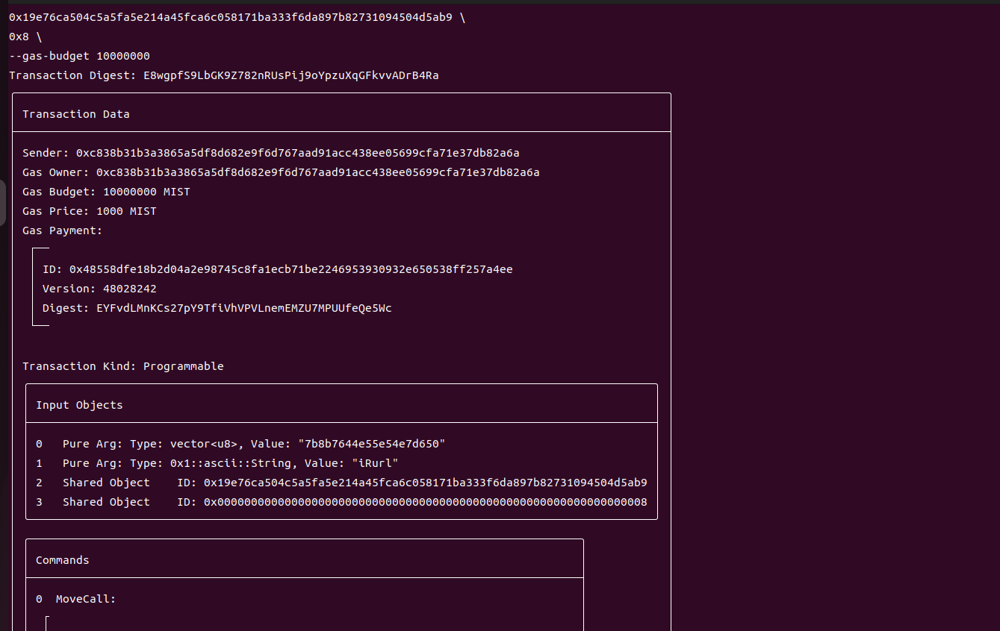
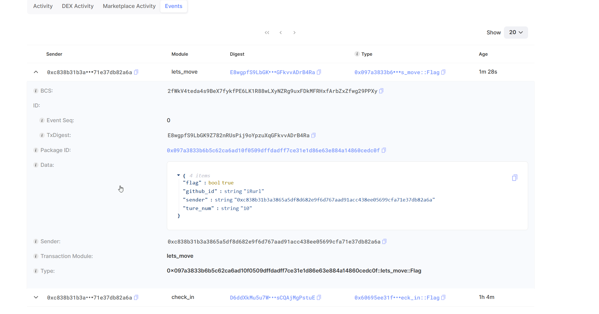

## 基本信息
- Sui钱包地址: `0xc838b31b3a3865a5df8d682e9f6d767aad91acc438ee05699cfa71e37db82a6a`
- github: `iRurl`


## 任务

##   01 hello move  

- [x] Sui cli version: 1.27.0
- [x] package id: `0x6a76df9bd2e60459179386f13e3403bc015ad51990ddf412b99be831c98984b3`
- [x] Sui钱包截图:
- [x]  
- [x] package id 在 scan上的查看截图:

##   03 move NFT
- [x] nft package id :0x786a939e5c5eeec8819c758f073f8d3bb2f272ca69949ff4fed04aec0e29bc71
- [x] nft object id : 0xe0454b504a463a896b948fd1ac128ccb14e4457df81703b87a6b24b4e73eda7d
- [x] 转账 nft  hash: 99gRvszVXzW6jjHtc7f6U9ptVZvXbTdEgbhAWukEf64R
- [x] Sui cli version: 1.27.0
- [x] CLI call截图: 
- [x] scan上的查看截图:

##   07 Check_in
```
sui client call \
--function get_flag \
--module check_in \
--package 0x60695ee31f93add1f79909c884a55dff7e5f140bbd2e495819966bd2f7971d42 \
--args \
'>~IdndKPnLw4' \
0x011f9404e6f167e549b617a53eea058029167a2beac26c624cbc3550e04b5ad2 \
0x8 \
iRurl \
--gas-budget 10000000
```
- [x] Sui cli version: 1.27.0
- [x] package id: 0x60695ee31f93add1f79909c884a55dff7e5f140bbd2e495819966bd2f7971d42 
- [x] Transaction Digest: D6ddXkMu5u7WC86nGZWh3Qf65DppgoDZsCQAjMgPstuE
- [x] CLI call截图: 
- [x] scan上的查看截图:

##   08 Lets_move
```
sui client call \
--function get_flag \
--module lets_move \
--package 0x097a3833b6b5c62ca6ad10f0509dffdadff7ce31e1d86e63e884a14860cedc0f \
--args \
7b8b7644e55e54e7d650 \
iRurl \
0x19e76ca504c5a5fa5e214a45fca6c058171ba333f6da897b82731094504d5ab9 \
0x8 \
--gas-budget 10000000
```
- [x] Transaction Digest: E8wgpfS9LbGK9Z782nRUsPij9oYpzuXqGFkvvADrB4Ra 
- [x] Sui cli version: 1.27.0
- [x] package id: 0x60695ee31f93add1f79909c884a55dff7e5f140bbd2e495819966bd2f7971d42 
- [x] CLI call截图: 
- [x] scan上的查看截图:
